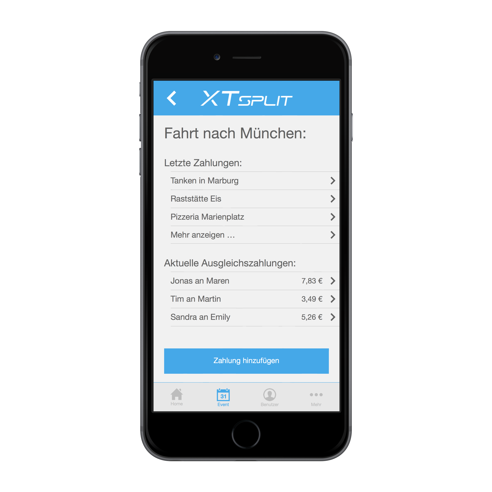

# proSplit

proSplit helps you split your bills when spending time with your friends.

You can create events, add contacts to the event and everyone can enter bills he paid. 
At any time you see who wpent how much money and who should pay whom to equalize all bills.

## Technologies

proSplit uses the JavaScript-Framework Meteor which delivers real time comunication with a MongoDB database.

